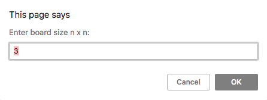

# SpartaGlobal-TicTacToe

## How to run:

To run the TicTacToe game you should open the index.html file inside your browser. Or if you clone inside a folder then use the following commands to run the file.  
Open through mac terminal:

    open /SpartaGlobal-TicTacToe/index.html

Open through windows terminal:

    start /SpartaGlobal-TicTacToe/index.html

Open through linux terminal:

    xdg-open /SpartaGlobal-TicTacToe/index.html

## How to use:

When you first open the window you will be greeted with a prompt window where you will have to input a number. Recommended 3 (3x3) - 20 (20x20) without breaking the css.

After the grid is generated you will have to play TicTacToe until someone have won or it's a draw, which then you will be greeted with another alert stating who has won or if it's a draw then it resets the game by and you select the size of the grid again.
